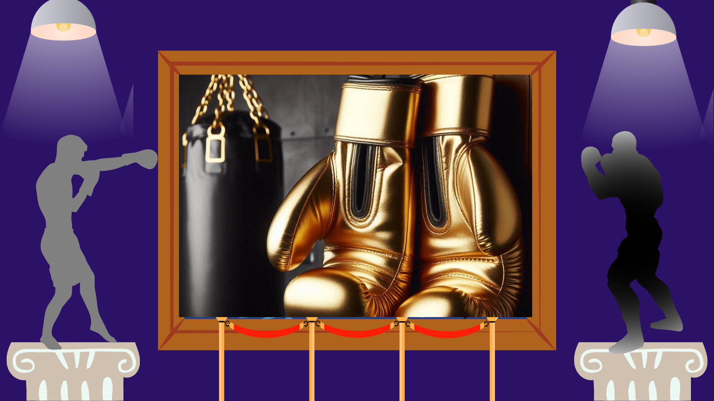
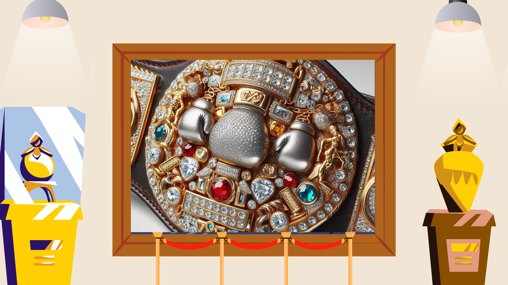
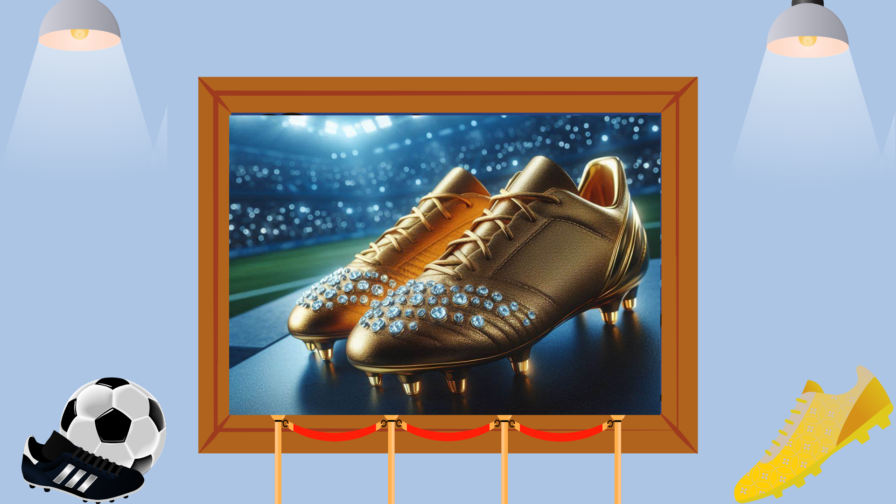
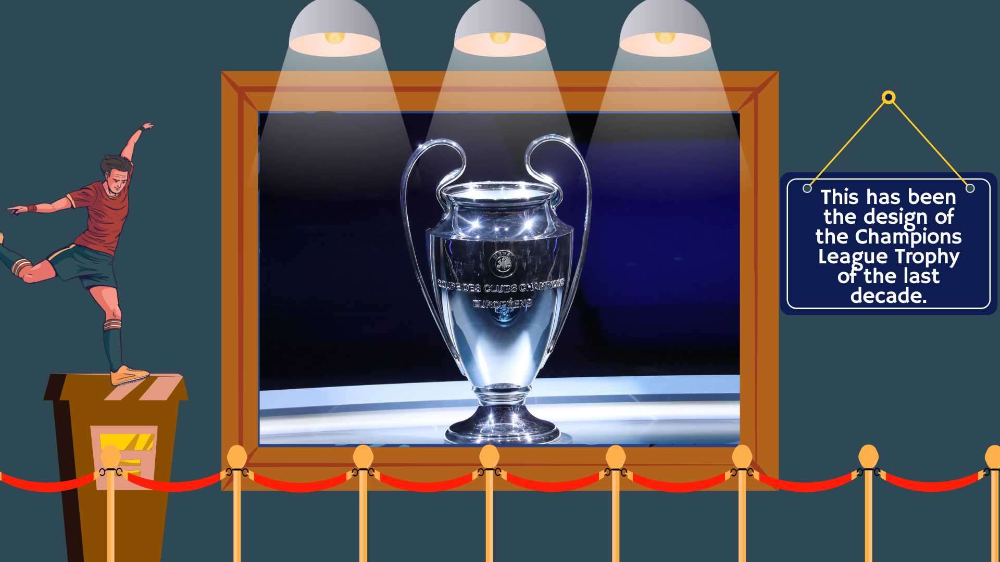
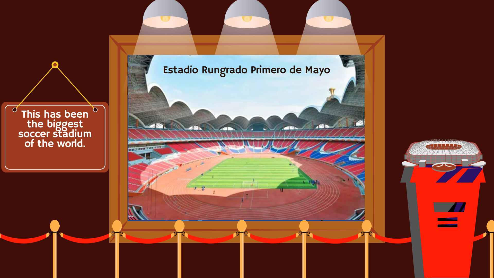
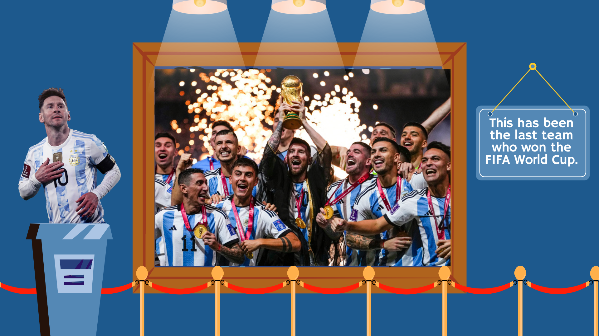
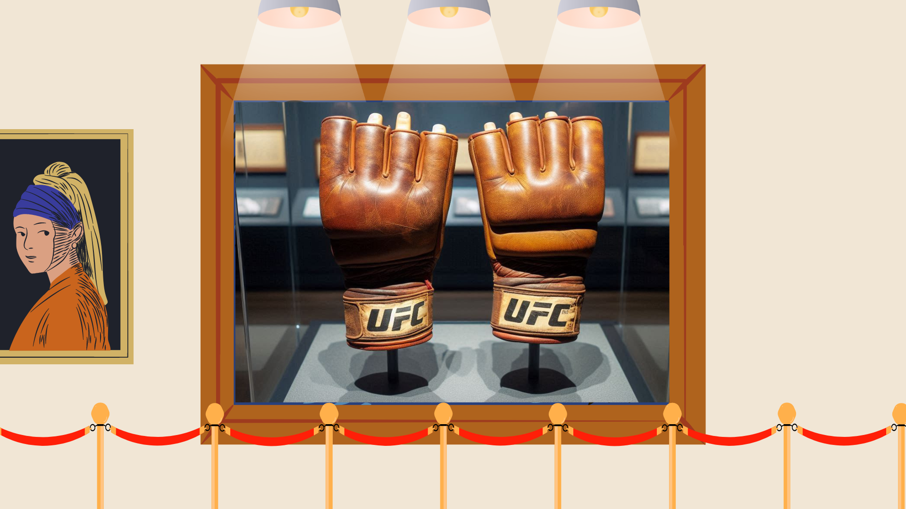
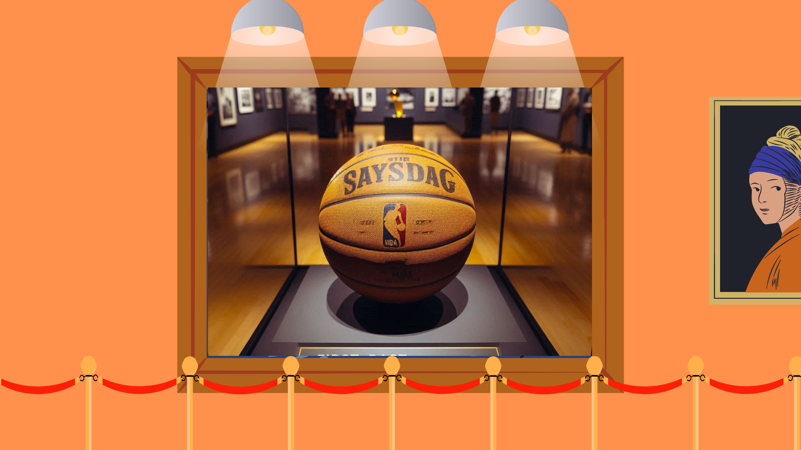
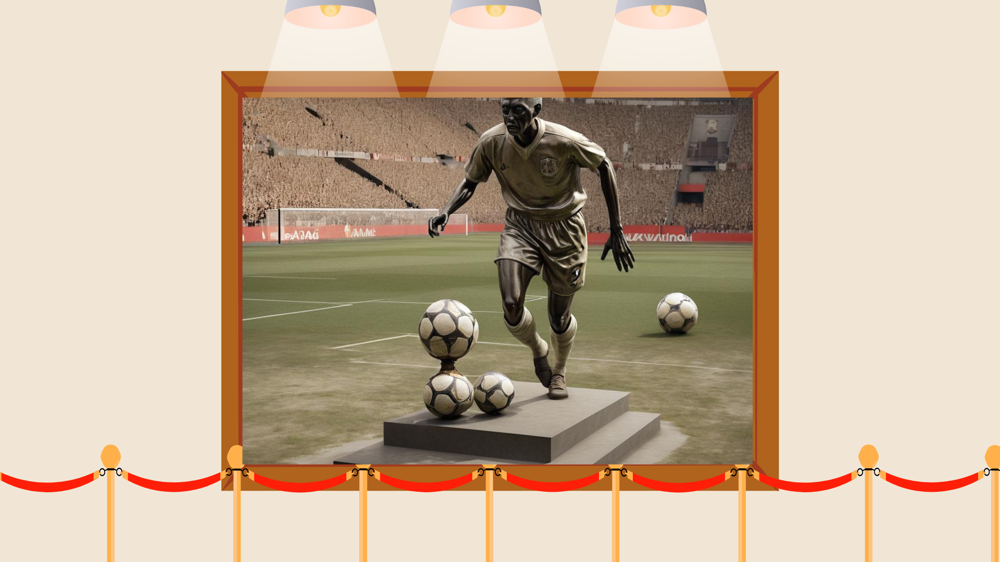
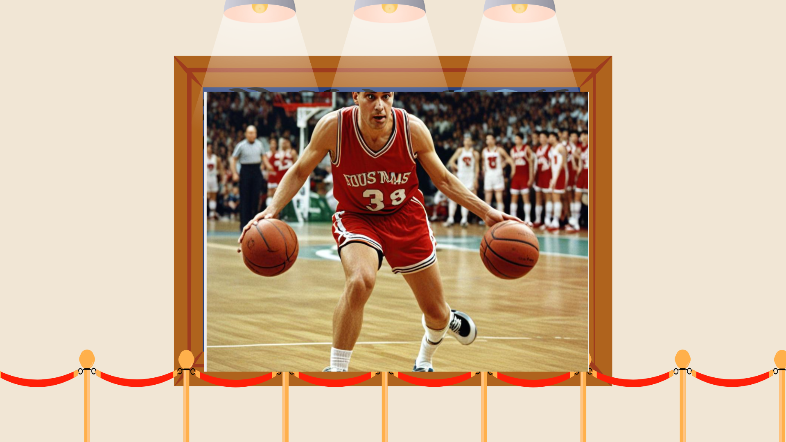

# ELF-PROJECT

<!DOCTYPE html>

<html>

<head>
    <link rel="stylesheet" href="styles.css">

</head>

<body>

    

    <header class="header">
        <section class="nave">
            
            <nav>
                <a href="index.html">Home</a>
                <a href="#museo">Museum</a>
                <a href="#final">Members</a>
            </nav>
        </section>
    </header>

    <section class="intro">
        <h4 class="textos">ELF PROJECT</h4>
        <h3 class="textos">MUSEUM</h3>
        <h1 class="textos">SPORTS</h1>
        <h2 class="textos">This museum displays</h2>
        <h2 class="textos">various sport´s historic objects.</h2>
         
        <h3 id="scroll" class="textos">⬇ SCROLL ⬇</h3>
    </section>

    <section class="imagenes">

        

            
            

            
These shiny gold and black boxing gloves have always meant big wins in boxing.

            
Lots of famous fighters have put on these gloves, showing off their skills and winning big fights.

            
Many champions have loved wearing these gloves, showing how much hard work it takes to be the best in
                boxing.

            
These special gloves are all about being the best in boxing, something every boxer dreams of.

            
Every time someone new becomes a champ, these gloves remind everyone of all the hard work it takes to
                win, making them super special in boxing history.

            

        

        

            
            
This special boxing belt has been worn by lots of boxing stars over the years.

            
Famous fighters have proudly shown off this cool belt.

            
Many champs have paraded around with this belt, feeling like champions with its fancy design.

            
Since its creation, this awesome boxing belt has shown who's the best in boxing, making every boxer dream
                of winning it.

            
Every time a new champ gets this amazing belt, it reminds everyone of all the hard work it takes to be
                the best in boxing, making it even more special.

        

        

            
            
Lots of famous footballers have worn these special cleats over the years, made of shiny gold with
                diamonds on the front.

            
Big players have proudly worn these famous cleats, showing off their skills and style on the field.

            
Many winners have played in these fancy cleats, feeling like champions with their fancy look.

            
Since they first came out, these amazing cleats have been all about being the best in football, making
                every player dream of wearing them.

            
Every time a new player wears these incredible cleats, it reminds everyone of all the hard work it takes
                to be the best in football, making them really special.

        

        

            
            
This has been the design of the Champions League Trophy of the last decade.

            
Many teams have competed hardly to lift this prestigious trophy.

            
The design of the trophy has impressed fans and players alike.

            
Several champions have celebrated their victories with this iconic design.

            
This trophy has symbolized excellence and achievement in European football.

        

        

            
            
This has been the biggest soccer stadium in the world.

            
Countless matches have been played here.

            
Millions of fans have attended events at this venue.

            
Teams from all over the globe have competed on its field.

            
The stadium's facilities have been upgraded regularly to maintain its status.

        

        

            
            
This has been the last team who won the FIFA World Cup.

            
They have celebrated their victory with a grand parade.

            
The players have received numerous accolades and awards.

            
Fans have shown immense pride in their national team.

            
The victory has inspired a new generation of soccer players.

        

        

            
            
Initially, in MMA fights, fighters haven't used gloves and have fought barehanded.

            
Later, they have started using wraps, which have provided extra hand protection but have often resulted
                in cuts on the skin of those receiving punches.

            
The small, fingerless gloves commonly seen in Mixed Martial Arts (MMA) have first appeared in the
                Japanese fighting organization called Shooto.

            
These gloves have become necessary to protect fighters’ hands and faces due to the significant number of
                cuts they have sustained during fights.

            
The introduction of gloves has not only enhanced safety but also made fights more exciting and
                action-packed.

        

        

            
            
Since its creation in 1894, the first basketball has evolved significantly.

            
In 1949, Spalding introduced the first official NBA basketball, featuring a thicker leather cover and
                improved stitching design.

            
Throughout the decades, this iconic ball has been a fundamental part of professional basketball games.
            

            
Over the years, the ball has changed to adapt to different levels and ages of play.

            
Until 2021, the Spalding NBA Official Game Ball was the standard in the NBA.

        

        

            
            
The statue of the man kicking the ball has stood in the football museum for decades, captivating visitors
                from around the world.

            
Many football fans have admired the relic, wondering about the player's identity and the significance of
                the moment captured in bronze.

            
Over the years, numerous photographs have been taken of visitors posing next to the iconic statue,
                creating lasting memories.

            
Historians have researched the origins of the statue, but its exact creation date and sculptor remain
                shrouded in mystery.

            
Countless legends have emerged surrounding the statue, with some claiming it brings good luck to those
                who touch its outstretched foot.

        

        

            
            
This legendary basketball player has broken countless records, astonishing fans and players alike.

            
Many teams have tried to sign this elusive star, but their identity has remained a mystery.

            
Over the years, this player has inspired numerous young athletes to pursue their dreams.

            
Fans have marveled at the incredible skill and agility demonstrated in every game.

            
This legend has transformed the sport, leaving an indelible mark on basketball history.

        

    </section>

    <footer id="final">
        <h1>Members:</h1>
        <section class="names">
            

                <h2>Joshua Saborío</h2>
                
4, 5, 6

            

            

                <h2>Daniel Zúñiga</h2>
                
9, 10

            

            

                <h2>Fabián García </h2>
                
1, 2, 3

            

            

                <h2>Ricardo Charpentier</h2>
                
7, 8

            

        </section>
    </footer>

</body>

</html>
